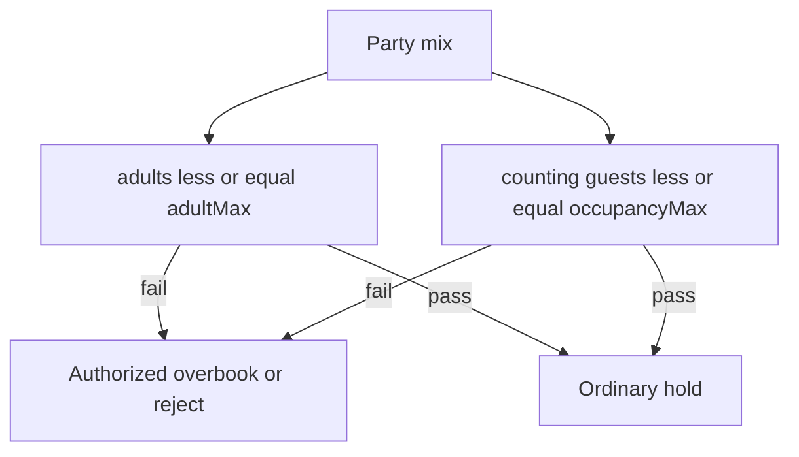

# Adult / child occupancy (plan only)

## What is wrong with two independent pools

If the form is “Adult 10” and “Children 12” as **two separate counters**, a departure could sell 10 adults **and** 12 children (22 people). That is over-relaxed versus the glass-boat story.

If the form is “Adult 10” and “Children 2” as a **hard child cap**, then 8 adults + 4 children fails even though the hull still has room. That is over-restricted versus the same story.

The story is: **adults cannot exceed 10; all counting guests cannot exceed 12.** Children fill leftover hull space. That is nested occupancy, not two independent inventories.

Worked example (`adultMax` 10, `occupancyMax` 12):

- 10 adults: OK (hull 10/12)
- 8 adults + 4 children: OK (adults 8/10, hull 12/12)
- 10 adults + 2 children: OK (adults 10/10, hull 12/12)
- 11 adults: **not** ordinary sale even if hull has 2 empty child-shaped slots
- 9 adults + 4 children: reject on hull (13 > 12) unless overbook
- Infants that already have `counts_toward_capacity = false` stay weightless (no slug hard-coding)

## Recommended schedule fields

Keep today’s `departures.capacity` as **maximum occupancy** (all passenger units that count toward capacity).

Add **adult capacity** (`capacity_adult`), always `1 <= capacity_adult <= capacity`.

Schedule add/edit in [apps/web/components/schedule-form-dialog.tsx](apps/web/components/schedule-form-dialog.tsx):

- **Adult capacity** (required when this model is on)
- **Maximum occupancy** (today’s seat capacity; label change)
- Live helper: `Child / mixed headroom = occupancy − adult` (e.g. 2)

Default for existing schedules: `capacity_adult = capacity` (behavior unchanged: every counting guest is an “adult-shaped” seat). Tenants who need the glass-boat pattern raise occupancy above adult (10 / 12).

Do **not** invent a third “children capacity” column. Child headroom is derived.

## Who counts as an adult vs a child

Do not key off the words “adult” / “child” only. Product options already have [passenger_units](apps/api/migrations/055_catalog_availability_model.sql) (`counts_toward_capacity`). Add a tenant-owned `occupancy_class` on the unit: `adult` | `child` | `none`.

Seed defaults by existing codes: `adult` → adult, `child` → child, `infant` → none (and `counts_toward_capacity` stays false for infants). Custom categories are mapped in Catalog, not hard-coded for Rock.

Hold/price already sums `countsTowardCapacity` into `seats` in [apps/api/src/inventory.ts](apps/api/src/inventory.ts). Split that into `seats` (hull) and `adultSeats` (class `adult` only).

## Availability and “seats left”

A single integer `available` is no longer enough for mixed parties.

At hold time, evaluate **this party** against remaining adult slots and remaining hull slots (including live holds). Reservation / Day Board / Crew copy should distinguish:

- Adult places left
- Occupancy left (can still be children)
- Sold out for adults but open for children
- Sold out

Walk-up “N seats left” on [apps/mobile/App.tsx](apps/mobile/App.tsx) must use the same remaining-hull number, plus an adult-sold-out hint when relevant.

## Overbooking (keep the current bar, add a tenant off switch)

Today: ordinary `committed <= capacity`; overflow lives in `overbooked`; staff with `inventory.overbook` create a reasoned hold ([pricing-and-inventory.md](docs/ARCHITECTURE/pricing-and-inventory.md), [apps/api/src/inventory.ts](apps/api/src/inventory.ts)). Reservations/dispatcher presets do **not** get that permission.

Keep that. Nested occupancy adds a second ordinary ceiling (`committed_adults <= capacity_adult`). Exceeding **either** ceiling is not a silent sale.

Tenant commercial setting (not a Rock special case), e.g. `overbookPolicy`:

| Setting | Effect |
| --- | --- |
| `authorized` (default, current) | Owner / ops manager can overbook adult and/or occupancy with reason + audit |
| `off` | Even privileged staff cannot; sold-out stays sold-out |

Do **not** add unlimited or public-web overbook. Channel/JungleBee stays out of this slice.

Implementation sketch: `committed_adults` + `overbooked_adults` on departures (mirroring committed/overbooked), `adult_seats` on holds. Confirm/cancel/amend in inventory and [apps/api/src/booking-changes.ts](apps/api/src/booking-changes.ts) must move both pools. Lowering schedule adult or occupancy still blocked when upcoming sold exceeds the new ceilings ([apps/api/src/catalog.ts](apps/api/src/catalog.ts) already blocks lowering total capacity).

## Surfaces in the same slice (so meters do not lie)

- Schedule metrics in [apps/web/components/administration.tsx](apps/web/components/administration.tsx) and [apps/web/components/catalog-schedules.tsx](apps/web/components/catalog-schedules.tsx): show `10 adults · 12 occupancy` not a single “18”
- Availability + new-reservation sold-out / overbook CTA
- Day Board / overview occupancy meters
- Crew board occupancy
- Tests in [apps/api/test/first-slice.test.ts](apps/api/test/first-slice.test.ts) for the glass-boat mixes above plus overbook-off

## Explicit non-goals

- Weighted seats (child = 0.5) — integer units only (ADR 004)
- Auto-deriving occupancy from fleet resource capacity ([shared-capacity-vs-fleet.md](docs/MODULES/Catalog/shared-capacity-vs-fleet.md))
- Google routing / GPS
- Per-vehicle private charter inventory
- Changing passenger **prices** (adult vs child rates already exist)

## Docs after acceptance

Short FEATURES note + update [pricing-and-inventory.md](docs/ARCHITECTURE/pricing-and-inventory.md) worked example. No Rock product names or numbers as platform defaults.
