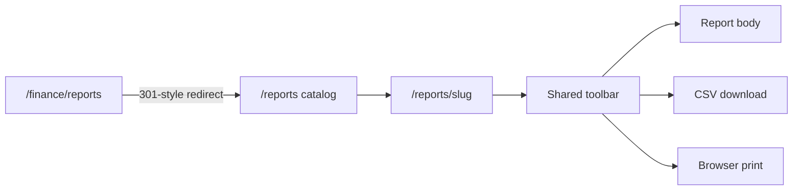

# Centralized Reports hub

## Why this is the right move

Finance is a **workbench** (queue, ledger, Pay). Reports are **read models** with an explicit date basis. Mixing them trains people to look for “the books” under Finance while Insights already owns `/reports` ([admin-navigation.md](docs/ARCHITECTURE/admin-navigation.md), [reporting-minimum.md](docs/FEATURES/reporting-minimum.md)).

ADR [008](docs/DECISIONS/008-reporting-in-postgres.md): reports stay SQL over live Postgres. No warehouse, no report builder.

**UX pattern (Xero / QBO / Stripe, adapted to ops):** catalog first, then one report at a time with a sticky toolbar. Do **not** stack Aging + Expense Summary + stubs on one scroll (current [finance-reports.tsx](apps/web/components/finance-reports.tsx)). Do **not** treat Day Board / Overview as reports — those stay action dashboards.

## Information architecture

- **Aside:** keep Insights → Reports. Remove Finance sub-nav **Reports** from [finance.tsx](apps/web/components/finance.tsx).
- **Routes:** `/reports` catalog; `/reports/:slug` viewer. Redirect `/finance/reports` (and `#` hashes if any) to `/reports` or `/reports/partner-aging`.
- **Finance:** Overview / Partners / Expenses only. Aging and expense totals remain **linked** from Overview (“See report”) so finance staff are not stranded.
- **Operational PDFs** (manifest, pickup list, receipt) stay on Ops via print-jobs. Reports use **browser print + CSV**, not the print agent.

Desktop catalog: grouped list (left, ~280px) + empty “choose a report” or last-opened viewer. Phone: catalog full width; opening a report is a second screen with Back.

## Shared report shell (the UX win)

One `ReportShell` in e.g. [apps/web/components/reports-hub.tsx](apps/web/components/reports-hub.tsx):

- Title, one-line **basis** (departure date vs paid-on vs as-of; timezone; reporting currency; no FX).
- Toolbar: period chips / as-of / entity filters as declared per report; **Export CSV**; **Print**.
- Body: existing tables/metrics; empty/error/loading already used on Reports.
- Print CSS: hide aside, chips, Export; show title + filters + table.
- CSV: client-side from the visible row model (same numbers as the screen). No new export API unless a report is too large (none of the live ones are).

Registry (not a plugin framework): `{ slug, group, title, description, permission, status: live | later, filters, Component }`. Hide reports the actor cannot run. `later` items are visible, honest, not clickable into fake numbers (same spirit as Finance “Not in this launch”).

## Report inventory (modules reviewed)

**Live now — move into the hub (increment 1)**

- **Operations — Period overview** (today’s `/reports`): [reports.tsx](apps/web/components/reports.tsx) + `GET reports/v1/overview`. Departure-date range, commercial + ops exception tiles, daily table.
- **Finance — Partner aging:** `GET finance/v1/finance-aging`. As-of, direction, partner; drill to `/finance/partners/:id`.
- **Finance — Expense summary:** `GET finance/v1/expenses`. Period; recorded vs reporting; after payments, show recorded / paid / outstanding if the list payload already has `period`.

**Assemble from existing APIs without new facts (increment 2, if you want it in the same PR or immediately after)**

- **Partner ledger extract** — one partner + date range from existing ledger GET; CSV is the “statement” until PDF exists.
- **Expense register** — same expenses list, print/CSV (Finance UI stays the editor).
- **Audit log** — wrap `ops/v1/audit` with date/actor/action filters (already a page; catalog entry deep-links or embeds).
- **Customers** — Insights customers is a directory, not a period report; catalog can deep-link, not duplicate.

**Name in the catalog as later (do not build)**

- Commercial: P&amp;L, tax, sales by product/channel, occupancy yield, no-show rate, source mix — blocked on FX policy, tax register, and/or new aggregations.
- Finance: commission summary, partner PDF statement, AR/AP cash forecast, bank rec, QBO/CSV journals ([accounting-export.md](docs/FEATURES/finance/accounting-export.md)).
- Ops: crew hours, assignment gaps over a season, pickup exception history (Day Board already answers “today”).
- Fleet: expiry calendar is Settings/Fleet work, not a fake report.
- Integrations: inbox/quarantine stays under Booking integrations.
- SaaS Zettaz billing: never mix into tenant reports.

Groups for the catalog: **Operations**, **Money**, **Partners**, **People & compliance**, **Later**.

## Permissions

Reuse existing grants. Typical mapping:

- Period overview: `bookings.read` (current Reports).
- Aging / expense summary / partner extract: `partner.statement.read`.
- Audit: existing audit read.
- Catalog shows only permitted live items; later items can show to owner/finance as “not in this launch” without implying data.

## Docs and nav contract

- Update [finance/PLAN.md](docs/FEATURES/finance/PLAN.md) §3–4.4: Finance Reports tab removed; aging/expense live under Insights → Reports.
- [reporting-minimum.md](docs/FEATURES/reporting-minimum.md): hub + three live reports; export/print boundary.
- [admin-navigation.md](docs/ARCHITECTURE/admin-navigation.md): Finance screens without Reports.
- Evidence: [docs/TESTING/reports-polish-evidence.md](docs/TESTING/reports-polish-evidence.md).
- Redirect so old `/finance/reports` bookmarks do not 404.

## Out of this plan

Print-agent report PDFs, scheduled email reports, saved favourites, column picker, warehouse, P&amp;L, QBO, Crew GPS, Stripe Connect sales reports.