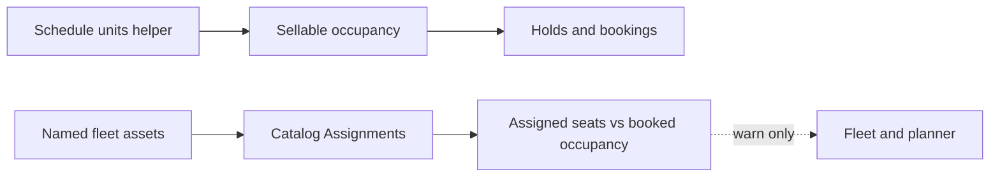

# Fleet as an operational roster (not a unit count)

## What “capacity” is — and is not

**18 tuk-tuks is not a Fleet capacity number.** Eighteen vehicles means **eighteen named assets** (Tuk Tuk 01…), because documents, overlap, and assignment need identity.

The “how many units on this run” idea already lives on Catalog → Schedule: **Units on this run × occupancy/adults/child per unit** fills sellable **Maximum occupancy / Adult / Child** ([`schedule-form-dialog.tsx`](apps/web/components/schedule-form-dialog.tsx)). That helper does not create or assign fleet rows.

Fleet `operational_resources.capacity` is **passenger seats on this one unit** (this tuk-tuk holds 6). It must not write holds or availability. Inventory stays on `departures.capacity` / `capacity_adult` / `capacity_child` ([`inventory.ts`](apps/api/src/inventory.ts)). Launch contract still defers maintenance/fuel/work orders.

## Why the page feels empty today

Value already exists off-page: assign in Catalog → Assignments, overlap conflict, expiry blocks assignment. Fleet itself is a directory (name, type, unused-feeling capacity). Capacity is stored and listed and **never compared to a trip**.

## Track A job (this increment)

Turn Fleet into the **asset roster for the next trips**: where each unit is going, whether its papers are current, and whether **assigned seats cover guests already booked**. Warn only — do **not** sell-block or auto-derive schedule occupancy from fleet.

### 1. Clarify the asset form

In [`apps/web/components/resources.tsx`](apps/web/components/resources.tsx):

- Relabel **Capacity** → **Passenger seats** with hint: seats on this unit; sellable occupancy is set on the schedule; register one row per vehicle/vessel, not a count.
- Keep type Vehicle / Vessel / Equipment.

### 2. Enrich assignment list (one API change)

Extend [`listAssignments`](apps/api/src/resources.ts) (`GET ops/v1/assignments`) to return, for each active assignment:

- `resource_capacity` (nullable)
- departure `committed`, `capacity`, `product_name`, `starts_at` (already have name/time)

No new table. No inventory writes. OpenAPI description only if the list schema is documented.

### 3. Fleet page: roster + coverage

On Fleet, load assignments (already permitted with `resources.write` / assignment reads as used by Catalog). Per asset:

- **Next trip** (soonest future active assignment): product · time, link to [`/catalog?tab=assignments`](apps/web/components/administration.tsx)
- **Passenger seats**
- **Docs** chip (expired / due soon) — already computed
- Idle copy when nothing upcoming: “Not assigned to an upcoming trip”

Page metrics (tenant timezone “today”):

- Active assets
- Assigned today
- Coverage gaps today: departures with at least one fleet assignment where **sum of assigned asset seats &lt; booked occupancy** (`committed + overbooked`). Skip a departure if every assigned asset has null seats (unknown, not a false gap).
- Keep expired-doc attention

Empty state stays **Add asset**.

### 4. Assignment planner: same coverage line

In [`catalog-assignments.tsx`](apps/web/components/catalog-assignments.tsx), on each departure card/planner cell with fleet assigned, show e.g. `Assigned seats 12 · booked 18 occupancy` and a short “short of booked occupancy” note when the sum is below booked. Still assign/unassign as today. No overbook permission change.

### 5. Tests and docs

- First-slice: after creating a resource with seats and assigning it, `GET ops/v1/assignments` includes `resource_capacity` and departure occupancy fields.
- Update [`resources-and-assignments.md`](docs/FEATURES/operations/resources-and-assignments.md) and one paragraph in [`shared-capacity-vs-fleet.md`](docs/MODULES/Catalog/shared-capacity-vs-fleet.md): seats-on-unit vs units-on-schedule vs sellable occupancy; coverage is readiness, not inventory.
- Evidence + sprint + ui-waiver row 14.

## Explicitly out of scope

- Sell-blocking or auto-filling schedule occupancy from assigned fleet
- Quantity/pool (“we own 18”) instead of named rows
- Fuel, defects, utilization history, work orders (Track B)
- Changing adult/child occupancy math
