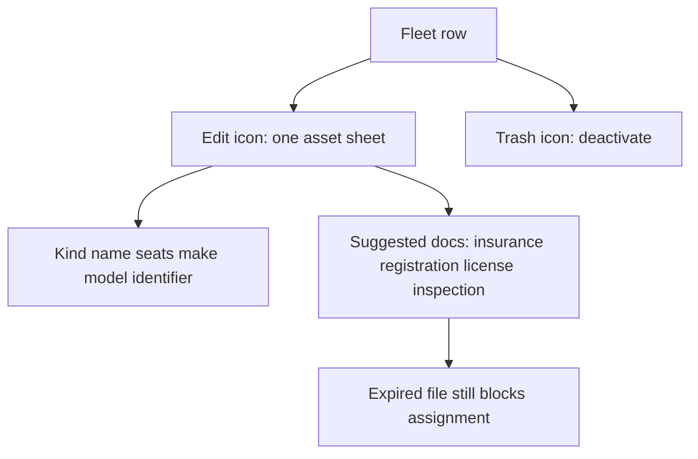

# Fleet kinds, identity, and one asset sheet

## What already exists

`operational_resources.type` is free text; the UI only offers **Vehicle / Vessel / Equipment**. Jet ski and kayak can already be stored, they just cannot be chosen.

License, registration, and insurance are already the Track A paper model: [`compliance_documents`](apps/api/migrations/021_resources_and_assignments.sql) (`document_type` + `expires_on` + file). Expired papers already **block assignment**. Duplicating policy numbers and expiry dates as columns on the asset would drift and fight that dialog.

Launch contract still defers fuel, defects, work orders.

## Product rules (this increment)

- **Kinds** are specific (jet ski, kayak, van) so assignment chips read usefully (`fleetAssignmentRole` already uses `label(resource.type)` in [`catalog-assignments.tsx`](apps/web/components/catalog-assignments.tsx)).
- **Identity** on the asset: facts that identify the unit in the yard.
- **Papers** stay documents. The merged sheet **suggests** types; tenants can still type a custom type. No Rock-specific required pack.
- **One modal** for add/edit + documents. Row **Edit** / **Remove** become icon-only; **Documents** as a separate row action goes away.

## 1. Kinds (platform list, not tenant-configurable yet)

Shared list (web + API enum or shared constant), grouped:

- **Land:** vehicle, van, bus, tuk_tuk
- **Water:** vessel, boat, jetski, kayak
- **Equipment:** equipment, snorkel_gear, other

Keep existing `vehicle` / `vessel` / `equipment` so current rows stay valid. API currently accepts any `type` string; tighten create/update to this list (existing unknown values remain editable but must pick a listed kind on save).

[`label()`](apps/web/lib/client.ts) already humanizes `jetski` / `tuk_tuk`.

## 2. Identity fields (migration)

Add nullable/empty text on `operational_resources`:

- `make`
- `model`
- `identifier` — plate, registration mark, HIN, or other unit ID (label: **Registration / ID**)

Passenger seats and notes stay. No VIN-required, no insurance policy number, no fuel/odometer.

Patch [`resources.ts`](apps/api/src/resources.ts) schema, list/create/update SQL, first-slice payload.

## 3. One asset sheet

Replace the two `FormDialog`s in [`resources.tsx`](apps/web/components/resources.tsx) with a single `staff-docs-dialog`-style sheet:

**Create:** identity fields; primary **Add asset**. After successful create, stay open in edit mode so papers can be added immediately (same pattern as “save then attach”).

**Edit:** two stacked sections:

1. Identity (kind optgroup select, name, code, seats, make, model, registration/ID, notes, active toggle)
2. Papers — reuse [`StaffDocumentAddFields`](apps/web/components/document-library.tsx) + [`StaffDocumentArchive`](apps/web/components/document-library.tsx), with a **datalist** of suggested types by kind family (land/water/equipment), e.g. Insurance, Registration, License, Inspection. Upload + expiry unchanged.

Primary submit saves **identity** when dirty; **Add document** stays the papers CTA (or one footer: Save asset; documents use their own add control in the papers section so a file add is not confused with identity save). Prefer: footer **Save** for identity; papers section has its own **Add document** button inside the section (not a second full-page dialog).

If the session lacks `documents.expiry.manage`, hide the papers section (same as today).

## 4. Icon-only row actions

On table and cards: **Edit** (pencil) and **Remove** (trash) as `icon-button` with `aria-label`. Opening Edit is the papers path. Name click still opens the same sheet.

## 5. Tests and docs

- First-slice: create with `type: "jetski"`, `identifier`; GET list returns them.
- [`resources-and-assignments.md`](docs/FEATURES/operations/resources-and-assignments.md): kinds + identity vs papers.
- Evidence, sprint, ui-waiver row 14.

## Out of scope

- Tenant-configurable type catalog
- Dedicated insurance/registration columns or required document packs
- Fuel, service intervals, defects, utilization history (Track B)
- Guest-stay **vessels** (cruise ships) — different entity under Tenant settings
