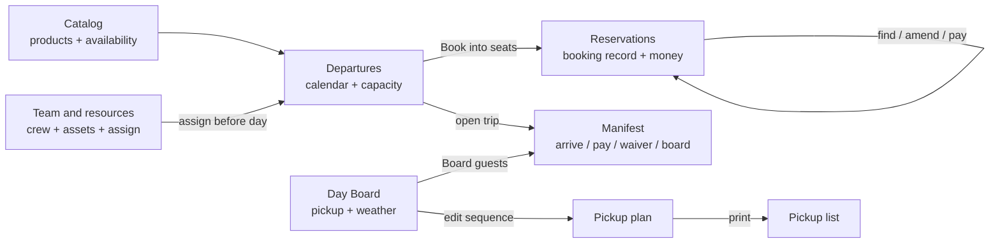
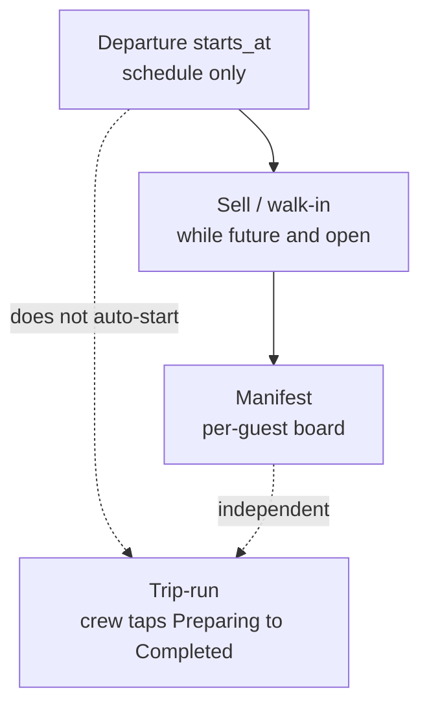

# Operations IA, Day Board polish, and next tasks

## Verdict

Your five-surface mental model is correct. Departures and Reservations **look** similar because both can create bookings, but they own different jobs. Do **not** merge them. Finish Day Board UX next (weather modal, then pickup plan/list clarity), and treat crew/fleet as **assign people/assets to a departure**—not a tuk-tuk stock inventory.

## Locked workflow

| Surface | One job | Book? | Board? |
| --- | --- | --- | --- |
| [Catalog](apps/web/components/administration.tsx) | What you sell and when it can run | No | No |
| [Departures](apps/web/components/views.tsx) | Sellable trip instances, capacity, open Manifest | Yes (bound to that trip) | Via Manifest link |
| [Reservations](apps/web/components/views.tsx) / [booking.tsx](apps/web/components/booking.tsx) | Find, hold, confirm, amend, money, party, pickup kind | Yes (search-first) | No |
| [Day Board](apps/web/components/dispatch.tsx) (`/operations`) | Today’s trips: pickup readiness, weather, path to board | No | Via **Board guests** → Manifest |
| Manifest | Only guest engagement: Arrived → Pay → Waiver → Board | No | Yes |
| Team & resources | People, assets, docs, assign to a departure | No | Readiness only |

Authority: [admin-navigation.md](docs/ARCHITECTURE/admin-navigation.md), [ADR 012](docs/DECISIONS/012-operations-pickup-planning.md), backlog item 1 in [implementation-backlog.md](docs/STRATEGY/implementation-backlog.md).

## Departures vs Reservations (why both stay)

- **Departures** answers: “What trips run, how full are they, book *this* trip, open boarding.”
- **Reservations** answers: “Find booking X, fix money/guests/pickup, amend/cancel.”
- Overlap to **fine-tune later (copy only, not merge):** keep one primary **New reservation** on Reservations; keep Departures row **Book** as the capacity-bound shortcut. Optional later: soften duplicate page-level CTA wording so it feels like the same booking system entered two ways.

## Pickup plan vs pickup list (clear distinction)

| | Pickup plan `/operations/:id/pickups` | Pickup list `/operations/:id/pickup-list` |
| --- | --- | --- |
| Job | **Edit** ordered stops (write) | **Print/read** paper-safe sequence + exceptions |
| Who | Dispatcher with `operations.write` | Anyone with `manifest.read` (+ print permission for PDF) |

Labels on Day Board today are easy to confuse. Planned UX copy: **Plan pickups** (edit) and **Print pickup list** (read). No merge into one page—print layout stays separate.

## Crew and fleet (keep simple)

**Already built (Track A minimum):** free-text resource types (vehicle/vessel/equipment), crew profiles, compliance docs, assign resource **or** crew to a departure with a role, overlap + expiry checks, Manifest readiness (`unassigned` / `ready` / `blocked`). See [resources-and-assignments.md](docs/FEATURES/operations/resources-and-assignments.md).

**Not built (and not next):** fleet stock ledger (“how many tuk-tuks do we own”), utilization, fuel, auto role packs per product (Tuk Tuk → driver+guide). Sellable inventory remains **scheduled departure seat capacity** ([inventory.ts](apps/api/src/inventory.ts)), not asset counts.

**Rock usage model:** register the tuk-tuks/boats/drivers you care about under Team & resources → assign them to each day’s departure → Manifest shows readiness. Roles stay free text (`driver`, `captain`, `guide`) until Rock supplies a real list—then seed records, don’t invent templates.

## Walk-in just before departure

**How it works today:** Walk-in is a booking **source** (`walk_in`), not a special booking type. Same path as phone:

1. Open the trip on **Departures** → **Book** (pre-bound) or **Reservations → New** and pick that departure.
2. Hold → confirm (money/party as usual) while the departure is still sellable.
3. Board on **Manifest** (Arrive → Pay if needed → Waiver → Board).

**Hard rules (server):**

- Hold/book is rejected once `starts_at <= now` (“Departure has already started”) — see [reservations.ts](apps/api/src/reservations.ts) / [inventory.ts](apps/api/src/inventory.ts).
- Also rejected when operational status is not `open` (weather hold / closed).
- Seat capacity still applies (available seats, including authorized overbook where permitted).

**Not built (and not in this Day Board cycle):**

- Booking *after* scheduled start (true last-second walk-on once the clock has passed).
- A dedicated “walk-in at dock” shortcut that skips hold/confirm.
- Auto-closing sales from catalog `cutoff_minutes` as a separate boarding-time policy (fields exist on availability rules; sellability today is primarily future + open + capacity).

**Practical Rock flow:** book the walk-in from Departures while the trip is still in the future and open, then immediately open Manifest and board. If the trip has already started by clock, staff cannot add inventory holds today—that would be a deliberate later policy (authorized late sell), not implied by source=`walk_in`.

## Trip start and progress (crew)

Three separate facts stay separate ([domain-and-states.md](docs/ARCHITECTURE/domain-and-states.md)):

| Layer | What it means | Who updates it |
| --- | --- | --- |
| Departure `starts_at` | Scheduled clock time | Catalog / schedule |
| Passenger check-in | Guest arrived / paid / waived / boarded | Manifest / crew check-in |
| **Trip-run** | Operational execution of the trip | Assigned crew only |

**How the app knows the experience “started”:** it does **not** auto-start from the clock. Assigned crew (or the web crew workspace) posts append-only events to `POST crew/v1/departures/:id/events`, which upsert `trip_runs` and append `trip_run_events` ([crew.ts](apps/api/src/crew.ts)).

**UI progress buttons today** (web [crew.tsx](apps/web/components/crew.tsx) + Expo mobile): `preparing` → `boarding` → `departed` → `completed`. Domain also allows richer states (`en_route_pickup`, `at_stop`, `delayed`, `cancelled`, `emergency`); those are not all exposed in the crew UI yet.

**Rules:**

- Only crew with an **active assignment** on that departure can record events.
- `completed` / `cancelled` trip-runs are final (no further state changes).
- Completing a trip-run does **not** flip bookings to “completed”; bookings stay commercial; boarding stays per passenger.

**Gap vs Day Board / Manifest:** trip-run state is recorded and used in the crew surface; Day Board and Manifest do **not** yet surface live run progress as a first-class dispatcher widget. That is a later thin read (show current trip-run on the Day Board card), not a new model—and it stays **after** Day Board acceptance / weather + pickup polish.

## Completion status (honest)

- **Done enough to use:** Catalog foundation, Departures calendar/capacity/Book, Reservations lifecycle, Day Board metrics + links, Manifest boarding Pay/partner clearance/waiver/board, pickup plan API + list PDF, resources/assignments, weather status API.
- **Almost done, needs polish:** Day Board UX (browser `window.prompt` / `window.confirm` for weather and recovery in [dispatch.tsx](apps/web/components/dispatch.tsx) ~373 / ~207); pickup plan/list visual IA; Close status exists in API but **no Close button** in UI.
- **Defer:** fleet inventory counts, Day Board assignment exception widgets, crew-mobile Pay, live printer agent, auto weather messaging, late sell after `starts_at`, Day Board trip-run status strip.

## What worth altering (ordered, one at a time)

### Task 1 — Day Board weather confirmation (your bug)
Replace `window.prompt` / weather-related browser dialogs with the existing in-app confirm/reason pattern used elsewhere in admin (same family as boarding sheets/modals in `common.tsx` / booking flows). Include reason field for Weather hold and Reopen. Add **Close** only if product still wants it in the same control (API already supports `closed`).

### Task 2 — Pickup plan / list IA + styling
- Day Board card actions: rename to **Plan pickups** / **Print pickup list**; keep **Board guests** primary.
- Pickup plan page: day-of focused layout—stop list first, create-location secondary/collapsed; clearer empty and save states; no drag-reorder required in this pass.
- Pickup list: keep print-first; tighten hierarchy to match Manifest print polish.

### Task 3 — Owner acceptance evidence
After Tasks 1–2, walk phone/tablet/desktop empty/error/permission and write `docs/TESTING/` evidence (backlog #1). No new ops features until that passes.

### Task 4 — Soft nav copy only (optional small follow-on)
Clarify Departures subtitle vs Reservations so “Book” vs “find booking” is obvious. No route merge.

### Task 5 — Leave Team & resources alone until Rock data
Then seed real crew/assets and assign; optionally a thin Day Board “unassigned/blocked” strip reading existing assignment API—**after** Day Board acceptance.

## Explicit non-goals for this cycle

- Merging Departures into Reservations or Day Board into Departures
- Book on Day Board
- Second boarding UI
- Fleet stock / “N vehicles available”
- Product-required crew templates (driver+guide packs)
- Reworking Catalog or Manifest boarding money path
- Late inventory sell after departure `starts_at`
- Auto trip-run start from the clock; Day Board trip-run strip (later, after acceptance)

## Implementation touchpoints (when you approve execution)

- Weather + Day Board links: [apps/web/components/dispatch.tsx](apps/web/components/dispatch.tsx)
- Shared modal/confirm: [apps/web/components/common.tsx](apps/web/components/common.tsx) (reuse existing dialog patterns)
- Docs sync after acceptance: [admin-navigation.md](docs/ARCHITECTURE/admin-navigation.md), [MEMORY.md](docs/AI_CONTEXT/MEMORY.md), [implementation-backlog.md](docs/STRATEGY/implementation-backlog.md), TESTING evidence

## Success criteria

- Weather hold never uses a browser prompt; reason captured in-app
- Staff can explain plan vs list in one sentence from the labels alone
- No new resource/inventory model
- Backlog still says: finish Operations acceptance before the next page in the UI task list
