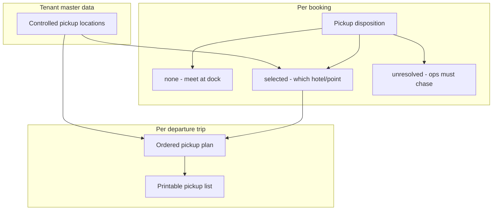

# Pickup module — how it works and recommended path

## Short answers

**DAY BOARD / Day board** — Redundant. Keep one title (“Day board”); drop or soften the eyebrow later as a tiny polish.

**Pickup Plans button beside View / Board?** — **No.** Day Board should stay **View / Board** + **Start trip**. Pickup planning stays under Manifest **Options → Plan pickups** (and Print list). A third primary button re-clutters the card we just simplified.

**Who is authorized?** (from [ADR 012](docs/DECISIONS/012-operations-pickup-planning.md) + RBAC)

| Action | Permission |
| --- | --- |
| See Day Board / read plan / print list | `manifest.read` (dispatcher, admin, owner, and limited other ops roles) |
| Save pickup **plan** (sequence, times, stop notes) | `operations.write` (owner, admin, dispatcher) |
| Create/edit/deactivate **locations** (today on Plan page) | same `operations.write` — **should move to Settings** for owners/admins |
| Choose pickup on a **booking** | reservations / booking flows (`bookings.create` / amend) |
| Crew follows stops in the field | assigned crew surfaces later; print list is the Track A driver handoff |

Reservations staff can see readiness on the board but cannot rewrite the plan.

**Locations only in Tenant settings?** — **Yes. Agree.** Controlled location library is tenant master data (like stays/hotels), not a day-of dispatch task. Plan pickups should only **pick** from the library.

---

## Mental model (this is the intended Track A design)

There are **two layers**. Confusing them is why the flow feels unclear.

1. **Booking (commercial fact)** — At reserve/amend time staff (or guest path later) set disposition:
   - **none** — no hotel pickup
   - **selected** — guest wants pickup; name/instructions point at a location concept
   - **unresolved** — still need to arrange
2. **Departure plan (ops fact)** — Dispatcher builds **one ordered stop list for that trip**: who to collect, in what order, at what time, with driver notes. Saved plan → paper/PDF for the driver.
3. **Driver/crew** — Do **not** invent a parallel plan in Track A. They execute the **saved plan / print list** for their assigned departure. They can override in the real world; the system does not yet capture live GPS or ad-hoc re-routing.

So: **guest selects / reservations records where; dispatcher plans when/order; driver uses the printed sequence.** Dispatcher can override the controlled location on a stop if ops need a different meeting point than the booking label implied.

---

## Shared hotels across multiple products

**Today (correct for Track A):**

- **Locations** are tenant-wide (Jolly Beach can serve many products).
- **Plans** are **per departure** (Kayak 9:00 AM has its own sequence; Clear Boat 11:00 AM has another).
- Same hotel on two morning tours = **two stops on two plans**, not one shared van roster.

**What we are not building yet:** one “shared run” that mixes guests from multiple products onto one driver list. That needs a new entity (day route / vehicle run), assignment of multiple departures to it, and different print/crew semantics. Explicitly out of [ADR 012](docs/DECISIONS/012-operations-pickup-planning.md).

**Track A default:** keep **per-departure plans**. If Rock’s real ops routinely run one van for two products, treat that as a **later** epic—not a Manifest/Day Board tweak.

If you already know shared multi-product runs are required for launch, say so and we re-scope; otherwise proceed with per-departure.

---

## Recommended way forward (concrete)

1. **IA copy** — Soften Day Board eyebrow/title redundancy; keep description focused on board/start, not “plan pickups” as the primary story.
2. **No new Day Board Pickup Plans button** — Path remains Manifest Options → Plan pickups / Pickup list.
3. **Move location CRUD off Plan pickups** into **Tenant settings** (new “Pickup locations” tab next to stays, or under Operations setup). Plan page: select location only + link “Manage locations in Settings”.
4. **Keep Plan pickups as sequencing-only** for one departure (Phase 1 polish already landed: readiness, exceptions, reorder, notes).
5. **Document the two-layer model** in `docs/FEATURES/operations/` so agents/staff don’t merge booking disposition with trip plan.
6. **Defer** shared multi-product runs, live driver re-plan, and SMS ETAs.

## Implementation slice (when you approve)

- Settings: Pickup locations list + FormDialog create/edit/deactivate (reuse existing `ops/v1/pickup-locations` APIs; gate with `operations.write` or a tighter settings permission if you prefer owner/admin only).
- Plan pickups: remove locations aside; keep dropdown + “Manage in Settings” link.
- Tiny Day Board heading polish.
- Short feature note: booking disposition vs departure plan vs print list.

No API domain change required for this slice.