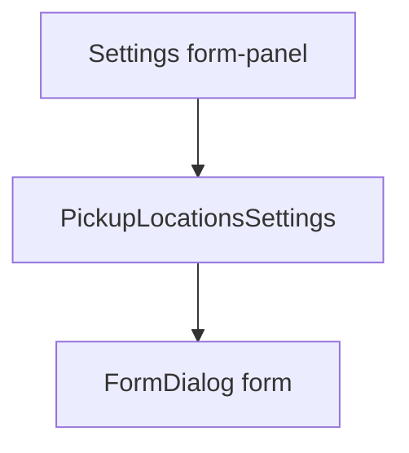

# Pickup location modal polish (no Google routing)

## Verdict on Google Maps / geolocation / routing

**Do not add Google Maps Places, Geocoding, Directions, or live GPS for Track A.**

| Capability | Already / Track A? | Recommendation |
| --- | --- | --- |
| Manual address, lat/lng, map URL on locations | **Yes** — schema + API + form already support it ([`apps/api/src/dispatch.ts`](apps/api/src/dispatch.ts), [`pickup-locations.tsx`](apps/web/components/pickup-locations.tsx)) | Keep; improve UX for entering them |
| Dispatcher-ordered pickup sequence | **Yes** — Plan pickups | Keep as staff-owned truth |
| Google Places autocomplete / geocode-from-address | **No** | Defer (API keys, billing, Antigua coverage, tenant policy) |
| Auto route optimization / turn-by-turn | **Explicitly out** — [ADR 012](docs/DECISIONS/012-operations-pickup-planning.md), [pickup-disposition doc](docs/FEATURES/operations/pickup-disposition-and-plans.md) | Do not build; plans stay staff-entered sequences |

Coordinates are for **dispatch context** (where is this hotel?), not for claiming a driveable route. A useful lightweight helper later (still no API key): open `https://www.google.com/maps/search/?api=1&query=…` from the saved address/coords. That is **not** routing.

## Root cause of the terminal error

Tenant settings wraps almost every tab in one save form:

```2926:2926:apps/web/components/administration.tsx
<form className="panel form-panel" onSubmit={submit}>
```

[`PickupLocationsSettings`](apps/web/components/pickup-locations.tsx) mounts [`FormDialog`](apps/web/components/common.tsx), which renders its own `<form>`. Nested forms → browser hydration warning. Integrations already avoid this by rendering **outside** that form (`tab === "integrations" ? … : <form>`).



## Implementation

### 1. Stop nesting pickup UI inside the settings save form

In [`administration.tsx`](apps/web/components/administration.tsx), mirror the integrations pattern:

- When `tab === "pickups"`, render `<PickupLocationsSettings />` in a `settings-tab-content` panel **outside** the config `<form>`.
- Keep other config tabs inside the form.
- Optionally apply the same for `resellers` if that tab also opens `FormDialog`s (quick check while touching the branch).

This is the correct structural fix: pickup CRUD does not participate in tenant-config `submit` anyway.

### 2. Harden FormDialog against future nesting

In [`common.tsx`](apps/web/components/common.tsx), portal `FormDialog` (and ideally `ConfirmDialog`) to `document.body` via `createPortal`, same pattern as [`subscription.tsx`](apps/web/components/subscription.tsx). That prevents accidental nested forms even if a dialog is mounted under another form later.

### 3. Polish Add / Edit pickup location modal

In [`pickup-locations.tsx`](apps/web/components/pickup-locations.tsx) (+ light CSS if needed):

- **Section the form:** Identity (name, code, kind) → Location (address, lat/lng, map link) → Operations (notes, visibility).
- **Clearer copy:** hint that lat/lng/map link are optional dispatch context and do **not** optimize Plan pickups order.
- **Slug UX:** generate hyphenated codes (`jolly-beach`) to match seeded location slugs; keep code editable on create only.
- **Map helpers (no API):** if lat+lng present, show “Open in Maps” using a constructed Google Maps query URL; if map URL empty and coords set, offer “Use maps link from coordinates” to fill `mapUrl`.
- **Validation feedback:** keep API lat/lng-together rule; surface busy/error as today.
- **List row:** show address snippet; link “mapped” to `map_url` when present.

### 4. Docs (short)

- One line in [`docs/FEATURES/operations/pickup-disposition-and-plans.md`](docs/FEATURES/operations/pickup-disposition-and-plans.md) or MEMORY: coords/map URL are staff-supplied; Google Places/routing remain deferred.
- No new Maps integration ADR unless/until a Track B epic is approved.

## Out of scope

- Google Maps JS SDK, Places Autocomplete, Directions, Distance Matrix
- Changing Plan pickups to auto-order by travel time
- Live driver GPS / ETA SMS

## Acceptance

- Open Settings → Pickup locations → Add location: **no** nested-form console error.
- Create/edit still saves name/kind/notes/address/lat/lng/mapUrl/visibility.
- Modal reads as grouped operational form; Open-in-Maps helper works from coords without any Google API key.
- Plan pickups behavior unchanged (manual sequence).
