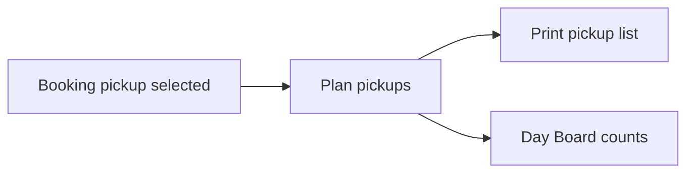

# Plan pickups — design review

## What the page is today

[`PickupEditor`](apps/web/components/dispatch.tsx) is a two-column planner:

- **Main:** ordered stops (lead, party, location select, datetime), add from “arranged not yet in plan”, dispatcher notes, Save
- **Aside:** tenant pickup-location CRUD
- **Header:** generic copy + link to Print list

Locked by [ADR 012](docs/DECISIONS/012-operations-pickup-planning.md): one replaceable ordered plan, controlled locations only, no route optimization, GPS, crew assignment, or guest messaging.

## Real-world scenarios the current UI under-serves

1. **Morning dispatcher builds the van run** — Needs product + departure time in the header, readiness (“3/5 planned · 1 unresolved”), and fast “add everyone with sensible defaults.” Today: no trip context in the title; Add stop dumps location = first library row and time = first stop or blank.
2. **Same hotel, three bookings** — Drivers think in stop geography. Today: one row per booking with no group-by-location and no reorder (only append/remove).
3. **Guest booked “Jolly Beach” but planner must override** — Selected location should prefill; override stays explicit. Today: selected name shows in the eligible list but is ignored on Add.
4. **Unresolved / walk-up hotel unknown** — Ops chase these before print. Today: unresolved only on Print exceptions and Day Board counts — invisible on Plan pickups itself.
5. **Driver note at a stop** (“use rear lobby, call on arrival”) — Print list already shows per-stop notes; editor saves `notes: ""` always and has **no stop-notes field**.
6. **Late booking after plan saved** — Eligible list helps, but no dirty-state warning, no “Add all”, easy to print a stale plan.
7. **Location library maintenance vs trip planning** — Mixing full location admin beside sequencing adds noise on phone/tablet; library is tenant-wide, not trip-specific.
8. **Time entry** — `datetime-local` without clear tenant-timezone labeling or “minutes before departure” shortcut invites wrong-day times.

## Gaps ranked (impact vs effort)

| Priority | Gap | Why it matters |
| --- | --- | --- |
| P0 | Trip context + plan readiness in header | Orientation; matches Manifest polish |
| P0 | Show unresolved + “selected but not in plan” on this page | Closes the Day Board → Plan loop without opening Print |
| P0 | Prefill location from booking `pickup`; better default time | Stops wrong-hotel mistakes |
| P1 | Reorder stops (up/down) | Real sequencing without rebuild |
| P1 | Per-stop notes field | Data model + print already support it |
| P1 | Add all remaining eligible | Speed on busy days |
| P1 | Unsaved changes + clearer Save/Print relationship | Avoid printing stale plan |
| P2 | Collapse/move location library (Settings or drawer) | Reduce cognitive load |
| P2 | Group or sort suggestions by location | Same-hotel runs |
| Later | Route optimization, live map, SMS ETAs, phone on list | Explicitly out of ADR 012 |

## Recommended Phase 1 (when you want implementation)

Stay UI + existing API fields only — no new domain claims:

1. **Header** — product name, departure datetime badge, counts (`planned / required`, unresolved), back to Day Board / Manifest Options path.
2. **Exceptions strip** — unresolved + arranged-not-in-plan (reuse printable-list exception query or extend GET pickups).
3. **Smarter Add stop** — map booking’s selected location to controlled location when possible; seed time from departure start (or previous stop − fixed minutes only as a UI default, not a feasibility claim).
4. **Stop row** — Move up / Move down; editable stop notes; keep Remove.
5. **Bulk** — “Add all” for remaining eligible when locations exist.
6. **Save hygiene** — disable Print affordance or badge “Unsaved changes” while dirty; confirm before leave if dirty (light-touch).

Defer location-library relocation and group-by-hotel to Phase 2.

## Success criteria for Phase 1

- Dispatcher can open Plan pickups and know which trip and how complete the plan is without leaving the page.
- Adding a stop rarely requires re-picking the guest’s hotel.
- Stop order and driver notes can be set before Print without re-entering the whole plan.
- Unresolved pickups are visible where planning happens.