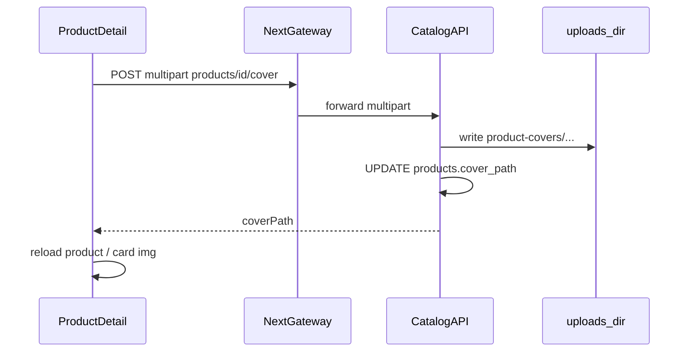

# Product cover photo upload

## Approach
Mirror tenant logo upload in [`apps/api/src/tenant.ts`](apps/api/src/tenant.ts) (`POST admin/v1/tenant/logo` → `uploads/tenant-logos/...` → `logo_path`), adapted for products:

- One **cover image** per product (not a gallery).
- Upload/replace from the **product edit page** (`ProductDetail`), same dropzone pattern as Settings → logo.
- Catalog cards already built: show `` when `cover_path` is set; keep kind gradient/icon placeholder when not.
- No upload on create (`/catalog/new`) — product must exist first (same as logo needing a tenant).

Accept **JPG / PNG / WebP**, max **2 MB**. Skip SVG for product photos (logos keep SVG).

## Data & API

1. Migration `087_product_cover_image.sql`
   - `ALTER TABLE products ADD COLUMN cover_path text;`

2. [`apps/api/src/catalog.ts`](apps/api/src/catalog.ts)
   - Add `p.cover_path` to `productSelect`.
   - New service method `uploadCover` (copy logo validation/write/rm-old pattern):
     - Path: `/uploads/product-covers/{tenantId}/{productId}/{uuid}.{ext}`
     - Update `products.cover_path`, bump `version`, audit `product.cover_updated`.
   - Optional clear: `DELETE` or `POST .../cover/clear` sets `cover_path` null and deletes file (small “Remove photo” on edit UI).
   - Controller: `POST products/:id/cover` with `FileInterceptor("file")`, `@Access("catalog.write")`.

3. Gateway allowlist — [`apps/web/app/api/gateway/[...path]/route.ts`](apps/web/app/api/gateway/[...path]/route.ts)
   - POST: add `products\/[a-f0-9-]{36}\/cover` (and clear if added).

4. Static proxy — [`apps/web/app/uploads/[...path]/route.ts`](apps/web/app/uploads/[...path]/route.ts)
   - Allow `product-covers/{tenantUuid}/{productUuid}/{fileUuid}.{jpg|png|webp}`.

## Frontend

1. Types — [`apps/web/lib/types.ts`](apps/web/lib/types.ts): `cover_path?: string | null` on `Product`.

2. Product edit — [`apps/web/components/administration.tsx`](apps/web/components/administration.tsx) `ProductDetail`
   - Branding-style control near the header (reuse `.logo-dropzone` / `.logo-control` patterns or a `product-cover-control` variant):
     - Preview current cover or placeholder
     - Hidden file input → `FormData` POST to `/api/gateway/admin/v1/products/{id}/cover`
     - Headers: `X-Tenant-Id`, `Idempotency-Key` (same as logo)
     - Busy / error states; reload product on success
     - Remove photo when a cover exists

3. Catalog cards — same file, products grid
   - If `p.cover_path`: render image as cover background (`object-fit: cover`)
   - Else: existing kind gradient + icon
   - Keep kind chip + status overlays

4. CSS — [`apps/web/app/globals.css`](apps/web/app/globals.css)
   - Cover `` fill; edit-page dropzone sized for a landscape cover (~16:10), not a square logo.

## Out of scope
- Multi-image gallery / customer-facing public CDN
- Cover upload on create form
- Quota accounting against plan “Storage” limits (same as logo today)

## Acceptance
- Owner can upload/replace/remove a cover on product edit (catalog.write).
- Catalog cards show the photo when set; placeholders when not.
- Uploads served only via allowlisted `/uploads/product-covers/...` paths.
- Existing logo upload unchanged.