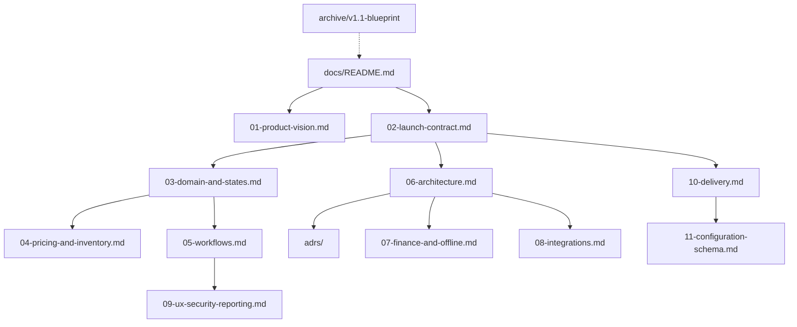

# Split blueprint into a working doc set

## Authority and archive

Leave the current file in place only as history, not as the spec agents implement from:

- Move [docs/Zettaz_Tours_Charters_Product_Blueprint.md](docs/Zettaz_Tours_Charters_Product_Blueprint.md) to [docs/archive/Zettaz_Tours_Charters_Product_Blueprint_v1.1.md](docs/archive/Zettaz_Tours_Charters_Product_Blueprint_v1.1.md)
- Add a banner at the top: superseded on 5 September 2026; use `docs/README.md` as the index
- Keep [docs/waiver-content-rock.md](docs/waiver-content-rock.md) as **tenant sample content**, not product spec (it is Rock Adventures tuk-tuk wording and still needs legal review)

Add a short [docs/README.md](docs/README.md) that states reading order, which doc wins on conflict, and that no Rock Adventures tour name, rate, pickup, or partner deal may be hard-coded.

Add a thin root [AGENTS.md](AGENTS.md) that points coding agents at `docs/README.md` and the first-slice doc. The old master prompt expected this file.

## Document map

Twelve working files plus ADRs is the split. That is enough to replace the monolith without scattering one decision across twenty stubs.

## What each new doc contains

**[docs/01-product-vision.md](docs/01-product-vision.md)** — Keep the thesis, competitive position, success outcomes, and users/roles from blueprint §§1, 3, 5. Tighten metrics: define authorized vs unauthorized overbooking; note that the 80% re-entry target needs a measured spreadsheet baseline.

**[docs/02-launch-contract.md](docs/02-launch-contract.md)** — New. The review’s main missing piece.

- Track A (Rock Adventures spreadsheet cutover) vs Track B (reseller portal, OTA certification, fleet suite, white-label, second tenant)
- In-scope / deferred table rewritten as two tracks, not “full platform”
- Explicit deferrals: WhatsApp bot, waitlists, GPS, new public checkout (WP stays), self-serve billing
- Track A must-haves the old doc under-specified: weather/closure + mass rebook, cruise-call entity, print/PDF manifest, assignment blocked on expired license/insurance, USD vs XCD
- Eight decisions that block E01 (stack is already NestJS; the other seven stay as open owner/evidence rows until you fill them)
- Suggested cutover window: 12–16 weeks after foundation, not the full sequential 32-week plan

**[docs/03-domain-and-states.md](docs/03-domain-and-states.md)** — Entities and invariants from §8, plus the three FSMs:

- Booking: draft, held, pending_payment, confirmed, cancelled, no_show, disputed, financially_closed. Booking **never** means boarded
- Passenger/check-in: not_arrived, arrived, balance_pending, waiver_pending, cleared_to_board, boarded, no_show, exception_approved
- Trip-run: preparing, en_route_pickup, boarding, departed, at_stop, delayed, completed, cancelled, emergency

Add entities the old model omitted: `Quote`, `PriceSnapshot`, `IdempotencyKey`, `OutboxEvent`, `ExchangeRate`, `CruiseCall`. Separate plan-tier feature flags from unfinished-connector flags.

**[docs/04-pricing-and-inventory.md](docs/04-pricing-and-inventory.md)** — New bounds.

- Phase 1 prices only: passenger category, seasonal calendar, one add-on, channel/contract override. Frozen `PriceSnapshot` on confirm
- Inventory by product type: shared tour = seat pool + optional exclusive resource; private charter = exclusive resource + duration (quote workflow; out of Track A unless you later promote it); transfer = vehicle + time window
- Holds + manual authorized overbooking in Track A; allotments/waitlists/release periods in Track B
- Worked capacity example so agents cannot invent a unified inventory engine

**[docs/05-workflows.md](docs/05-workflows.md)** — Direct, OTA/assisted, hotel/reseller (assisted Track A), day-of, cancel/refund from §7. Add weather/closure and cruise-pickup. Renumber migration as M1–M8 (the old file reused 35–42). Charter quoting marked deferred unless promoted.

**[docs/06-architecture.md](docs/06-architecture.md)** — Lock NestJS + Next.js + Expo + Postgres + Redis + S3 + outbox. Modular monolith, module list, API façades split (public, partner, staff, admin, OCTO). Identity partitions: tenant staff, partner users, customers are different principals. Tenancy: single Postgres, `tenant_id`, UUID, RLS as defense in depth. Reporting stays SQL views until Track B.

**[docs/adrs/](docs/adrs/)** — Short accepted ADRs so the stack is not rediscovered:

- `001-stack-nestjs.md`
- `002-modular-monolith.md`
- `003-tenancy.md`
- `004-money.md`
- `005-identity-partitions.md`
- `006-idempotency-and-outbox.md`
- `007-offline-sync.md`
- `008-reporting-in-postgres.md`

**[docs/07-finance-and-offline.md](docs/07-finance-and-offline.md)** — Ledger rules, check-in collection, commission triggers (Track A: simple partner invoice flag; full commission engine Track B). Currency: booking / collection / reporting + recorded rate. Offline conflict matrix: check-in append, payments append (never last-write-wins), assignments server-authoritative, media eventually consistent.

**[docs/08-integrations.md](docs/08-integrations.md)** — Hub pattern, channel priorities, “do not promise Viator/GYG dates,” WP Travel Engine as P0, payments adapter interface, comms adapters. WhatsApp is staff-assisted capture only.

**[docs/09-ux-security-reporting.md](docs/09-ux-security-reporting.md)** — Surfaces from §13 (add print manifest), security/RPO-RTO from §12, metric definitions from §14 with “show the recognition basis” kept.

**[docs/10-delivery.md](docs/10-delivery.md)** — Track A ordered epics, first vertical slice (keep the old section 20 slice verbatim in spirit), testing/acceptance, migration checks. After-cutover backlog: E05 new checkout, E09 portal, E11 fleet, E14 OTA, E16 productization. Rewrite the coding-agent prompt to read this doc set, not the archive.

**[docs/11-configuration-schema.md](docs/11-configuration-schema.md)** — Seed/workbook schema: products, options, passenger categories, pickups, cruise fields, partners, payment methods, waiver template slots, currencies. Empty placeholders, no Rock Adventures prices or names as defaults.

## What will not be created

- No application code, schema migrations, or design-system files
- No filled Rock Adventures commercial data (contracts, live rates, gateway choice) — those stay as open rows in the launch contract
- No rewrite of insurer-ready waiver legal text; only a pointer from config schema to `waiver-content-rock.md` as a sample

## Writing rules for the new set

- Companion content is rewritten, not copy-pasted: Track A/B, FSMs, pricing bounds, NestJS lock, and missing ops workflows are first-class
- Cross-link instead of repeating long tables
- On conflict, `02-launch-contract.md` wins for scope; `03` wins for states; `06` + ADRs win for stack
- Version stamp each working doc as 2.0 / 5 September 2026
