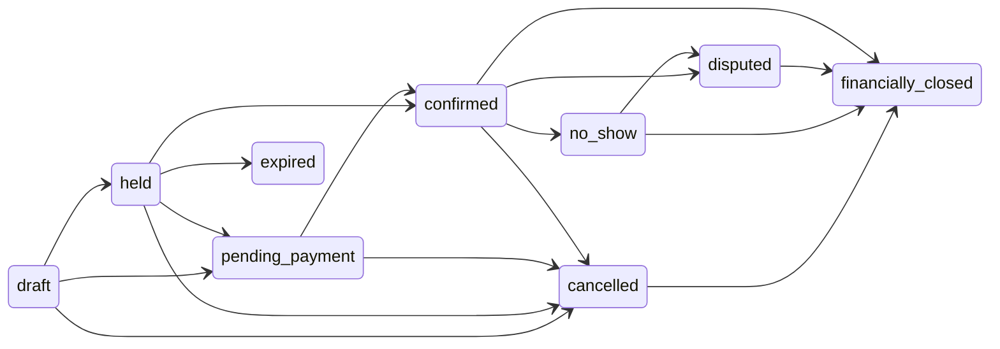

# Domain model and state machines

**Version 2.0 · 5 September 2026**

This document wins on entities, invariants, and states. Index: [README.md](../README.md).

## Conventions

- UUID/ULID identifiers.
- `tenant_id` on every tenant-owned row.
- UTC timestamps plus tenant timezone for display.
- Soft deletion only where legally and operationally appropriate.
- Optimistic concurrency (`version` / ETag).
- Append-only financial, waiver, incident, and audit events.
- Corrections use reversals or superseding versions, never silent rewrite of facts.

## Core entities

| Domain | Core entities |
| --- | --- |
| Platform | Tenant, Subscription, PlanFeatureFlag, TenantDomain, TenantSetting, ConnectorFeatureFlag |
| Identity | User, Role, Permission, Membership, SupportAccessGrant, Device |
| Catalog | Product, ProductOption, PassengerUnit, RatePlan, AddOn, Policy, Media |
| Schedule | AvailabilityRule, AvailabilityRuleTime, AvailabilityException, Departure, CapacityPool, InventoryHold, WaitlistEntry (Track B) |
| Resources | ResourceType, Resource, ResourcePool, RequirementRule, ResourceAssignment |
| People | StaffProfile, Qualification, Availability, StaffAssignment |
| Customer | Customer, Passenger, ContactMethod, AccommodationStay, CustomerConsent |
| Booking | Booking, BookingItem, PassengerAllocation, PickupSelection, BookingChange, Quote, PriceSnapshot, Note, Task |
| Partner | PartnerOrganization, PartnerAgent, Contract, ContractRate, Allotment (Track B), CommissionRule (Track B) |
| Finance | Payment, PaymentTransaction, Refund, Invoice, InvoiceLine, CreditNote, CommissionAccrual, Settlement, ExchangeRate |
| Operations | PickupLocation, Route, RouteStop, CruiseCall, TripRun, TripEvent, CheckIn |
| Documents | WaiverTemplate, WaiverVersion, WaiverSignature, Ticket, Voucher, Attachment, AssetDocument |
| Fleet/Safety | InspectionTemplate, Inspection, Defect, WorkOrder, FuelLog, Incident (full suite Track B) |
| Integration | ConnectorAccount, ExternalMapping, WebhookInbox, WebhookDelivery, SyncJob, ReconciliationIssue, IdempotencyKey |
| Governance | AuditEvent, OutboxEvent, DataExport, RetentionRule, Notification, Message |

### Entities added in v2.0

| Entity | Role |
| --- | --- |
| Quote | Pre-confirm commercial offer (reseller or charter). Distinct from Hold and Booking. |
| PriceSnapshot | Immutable copy of priced lines, currency, and rate at confirm (or at each accepted change). |
| IdempotencyKey | Dedupes booking, payment, refund, and connector mutations. |
| OutboxEvent | Transactional outbox row for notifications, channel sync, and documents. |
| ExchangeRate | Recorded rate used for a booking or transaction; not a live lookup after the fact. |
| CruiseCall | Ship, date, arrival/departure, port, tender/all-aboard. Bookings and pickups can link here. |

`WaitlistEntry`, `Allotment`, and rich `CommissionRule` exist in the model so Track B does not require a rewrite. Track A must not implement their behavior.

### Two kinds of flags

| Kind | Meaning | Example |
| --- | --- | --- |
| PlanFeatureFlag | What the tenant’s subscription allows | Reseller portal, extra location |
| ConnectorFeatureFlag | Engineering: unfinished or uncertified integration | Viator adapter, OCTO façade |

Do not use one flag table for both. A dark connector is not a pricing plan.

## Catalog and availability boundary

`Product` describes the customer-facing thing being sold. A product owns one or more `ProductOption` records; each option defines duration, confirmation and pricing behavior. `PassengerUnit` defines bookable units such as adult, child, group or vehicle, while `RatePlan` supplies dated prices. Core commercial fields are relational; connector-specific extensions may use namespaced JSON.

Every product declares one availability mode: `fixed_departure`, `opening_hours`, `open_dated`, `on_request`, or `resource_window`. `AvailabilityRule` expresses the reusable selling rule and local timezone, `AvailabilityRuleTime` stores its daily times, and `AvailabilityException` closes or overrides a particular local date. A `Departure` is the operational dated instance generated from a rule. Private charters use resource-window inventory and must not be represented as a one-seat shared departure.

Migration 055 preserves existing product, schedule, departure, booking, and reservation identifiers while backfilling the normalized records. The legacy product definition and schedule tables remain compatibility inputs until all booking and connector adapters read the normalized model.

## Key invariants

- Confirmed capacity cannot exceed configured capacity unless an authorized override event exists.
- A resource or staff member cannot have overlapping incompatible assignments.
- A resource or staff member with an expired required document cannot be assigned unless an authorized override exists.
- Booking totals equal priced items plus fees/tax less discounts. Payments and refunds never rewrite those commercial facts. The `PriceSnapshot` is the commercial fact after confirm.
- External events are processed exactly once logically, even when delivered more than once.
- Financial transactions, signed waivers, audit events, and incident history are append-only.
- Tenant isolation is enforced in database access, cache keys, object storage paths, queues, logs, and analytics.
- A completed trip cannot silently change partner commission; changes create an adjustment and approval trail.
- Booking status never means a passenger boarded. Boarding is a passenger/check-in fact and a trip-run fact.

## Three state machines

v1.1 mixed booking status, passenger check-in, and trip-run into one list and defined “checked in” as boarded. That is incorrect. Implement three FSMs.

Expired is a terminal outcome of `held` when the hold lapses. Treat it as cancelled-from-hold for inventory (capacity released) without implying a customer cancellation policy.

### Booking

A booking is a commercial and inventory commitment. It is not a trip and it is not a passenger’s boarding state.

| State | Entry condition | Typical next states |
| --- | --- | --- |
| draft | Incomplete internal or assisted entry | held, pending_payment, cancelled |
| held | Capacity reserved until expiry | pending_payment, confirmed, expired, cancelled |
| pending_payment | Booking data valid; payment or credit approval pending | confirmed, cancelled |
| confirmed | Capacity committed; `PriceSnapshot` frozen | cancelled, no_show, disputed, financially_closed |
| cancelled | Cancellation recorded | refund pending (finance), financially_closed |
| no_show | Guest failed to attend (booking-level; usually after departure window) | financially_closed, disputed |
| disputed | Channel, guest, or partner dispute opened | financially_closed |
| financially_closed | No further expected money movement | — |

There is no booking state `checked_in`, `in_progress`, or `completed`. Those belong to passenger/check-in and trip-run.

### Passenger / check-in

One record per required guest (or per booking passenger allocation). Staff see these on the check-in screen.

| State | Meaning |
| --- | --- |
| not_arrived | Default before arrival |
| arrived | Party or passenger found (QR or manual) |
| balance_pending | Arrival recorded; required money not settled |
| waiver_pending | Arrival recorded; required signature missing |
| cleared_to_board | Required payment and waiver conditions satisfied, or authorized exception recorded |
| boarded | Crew recorded the guest on the vehicle/vessel |
| no_show | This passenger did not attend |
| exception_approved | Authorized, reasoned, audited exception; may coexist with clearance |

`cleared_to_board` requires both financial clearance and required digital signatures, unless an authorized exception exists. Partner-invoiced and partner-collects bookings satisfy financial clearance by configured policy without taking a new guest payment (Track A web boarding). Prepaid and complimentary clearance by policy remain pending explicit booking flags. See [boarding balance collection](../FEATURES/operations/boarding-balance-collection.md).

A booking may be `confirmed` while every passenger is still `not_arrived`. A booking may remain `confirmed` after some passengers `boarded` and others `no_show`.

### Trip-run

One operational execution of a departure (or of a linked set of resources for that departure).

| State | Meaning |
| --- | --- |
| preparing | Assigned; readiness in progress |
| en_route_pickup | Crew moving to first or next pickup |
| boarding | At pickup/meeting point; check-in active |
| departed | Left origin / last pickup |
| at_stop | Intermediate stop |
| delayed | Delay recorded |
| completed | Operational completion recorded |
| cancelled | Trip will not run (weather, mechanical, demand) |
| emergency | Incident escalated; restricted access may apply |

Trip completion may trigger finance, review, and (Track B) maintenance events. It does not by itself change booking state to “completed.”

## Relationships that must stay separate

| Concept | Owns |
| --- | --- |
| Departure | Scheduled product instance, seat/resource capacity |
| Booking | Commercial commitment to a departure (or, later, a charter quote) |
| Passenger / CheckIn | Per-guest readiness and boarding |
| TripRun | Crew execution and live status |
| CruiseCall | Ship visit that pickups and bookings may reference |
| PriceSnapshot | Frozen money facts for a booking version |

## CRM rules

- Separate lead traveler, passengers, purchaser, accommodation, pickup, and emergency contact.
- Change date/time, product, party size, or pickup using a quote-difference against the current `PriceSnapshot` and policy checks. Accepting a change writes a new snapshot and a `BookingChange`.
- Customer timeline consolidates messages, waivers, payments, changes, incidents, and prior trips.
- Duplicate detection by email, phone, channel reference, and fuzzy name/date matching.

The mock reservation change increment follows [ADR 011](../DECISIONS/011-booking-amendments-cancellation.md): explicit quote acceptance for amendments, pre-departure cancellation, immutable history and separate finance review. Actual cancellation fees/refunds remain unconfigured.
