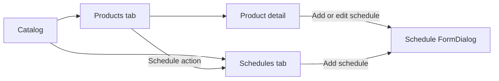

# Catalog schedules IA and product editor redesign

**Status:** Locked for implementation · **Date:** 12 September 2026  
**Surfaces:** Catalog list, product create/edit, schedule create modal  
**Related:** [catalog-departures-research.md](../STRATEGY/catalog-departures-research.md), [responsive-admin-layout.md](../ARCHITECTURE/responsive-admin-layout.md), [catalog-departures-evidence.md](../TESTING/catalog-departures-evidence.md)

## Problem

Catalog used **Products** and **Availability** with mixed wording (availability rule / schedule / Add availability / Schedule). The product-row **Schedule** action opened a full-page create form that felt disconnected from the product. Product pricing used dense inline editors (category rows + price matrix) instead of scannable tables.

## Locked information architecture

| Surface | Decision |
| --- | --- |
| Catalog tabs | **Products** \| **Schedules** (rename Availability) |
| Product-row Schedule | `/catalog?tab=schedules&product=:id` — list filtered to that product, or empty state if none |
| Schedules tab Add | Opens **schedule FormDialog** (not a dedicated full page) |
| Product editor sections | **Passenger categories**, **Seasonal rates**, **Schedules** — each a table with edit/delete icons; add/edit via `FormDialog` |
| Full-page Add schedule | Retired as primary UX; old `/catalog/availability/new` redirects into Schedules tab + modal |

URL query `tab=availability` remains accepted as an alias that opens **Schedules** during transition.

## Product editor — categories

- Table columns: label, identifier (slug), counts toward seats, default/from rate summary, actions.
- **Add / Edit** via FormDialog: label, slug, counts-toward-seats, **default rate** amount.
- On add: write that amount into **every existing seasonal period** for the new slug; if no periods exist, create one base period (today → +364 local days) with that amount.
- Remove requires at least one category remaining. Confirmed booking prices stay frozen (existing policy).

## Product editor — seasonal rates

- Table columns: period name/label (optional display of date range), start, end, per-category amounts summary, actions.
- **Add / Edit** via FormDialog: start date, end date, amount per category.
- **Delete:** before removing from draft, run a **date-window booking/hold check** for that product covering `[start, end]`. Block delete when open holds or non-cancelled bookings exist on departures in that window. Confirmed money remains in `price_snapshots` regardless.
- Heuristic is date-based (quotes do not store `ratePlanId` today).

## Product editor — Schedules

- Table of linked availability rules for the product: name, period, times, days summary, capacity, status, upcoming count, actions.
- **Add** opens the shared schedule FormDialog with product locked.
- **Edit (v1):** same Add schedule modal — rename plus capacity/dates/times/days with regenerate-on-edit guards. See [schedule-regenerate-on-edit.md](../MODULES/Catalog/schedule-regenerate-on-edit.md).
- Row may still deep-link to rule detail for departure list until that surface is folded in.

## Schedule FormDialog (create)

Replaces the full-page form. Field order:

1. **Schedule name** (required) — distinguishes multiple rules on one product (“Morning shared”, “Sunset”).
2. Row: **Tour**. **Units on this run** helper (tuk-tuk, boat, bus, jetski, kayak, etc.) then **Maximum occupancy** | **Adult capacity** | optional **Child capacity**. Does not assign fleet.
3. **Dates & times:** Start date | End date | first start time; **+** adds more local start times (stored on `availability_rule_times`).
4. **Operating days:** weekday presets paint a **month calendar** bounded by start/end; clicking days toggles them off/on. No separate “closed dates” list in the UI. Persist as `weekdays` + blackout/`availability_exceptions` under the hood (or equivalent).
5. Primary CTA shows live count: create **dates × times** departures.

### Why hybrid calendar (locked)

Pure per-date picking is hard for long seasons. Presets paint quickly; the calendar is the operator-facing truth and replaces blackout jargon.

### Create vs edit (v1)

| Action | Behavior |
| --- | --- |
| Create | `POST` schedules with name + `localTimes[]` + capacity + range + derived weekdays/blackouts |
| Edit | Same **Add schedule** `ScheduleFormDialog` in edit mode: full field edit with regenerate-on-edit (capacity/dates/times/days); booking/hold guards; tour locked |

Full hard-delete rule APIs remain **deferred**.

## API / data changes in this slice

- Migration: `availability_rules.name` (text, required for new rows; backfill from product title + time or `"Schedule"`).
- `scheduleSchema`: add `name`; change `localTime` → `localTimes` (array, min 1) while accepting legacy single `localTime` if needed for transition.
- Materialize one departure per (selected date × local time).
- Optional read endpoint or product-update guard for seasonal-period usage (holds/bookings in date window).

## Explicitly out of scope (next increment)

- Hard-delete / archive rule with cascading departure policy.
- One-off departure wizard separate from recurring rules.
- Rework of Departures operational calendar.
- Moving booked departures to a new clock time (must cancel/rebook first).

## Acceptance

- Catalog shows **Schedules**; product Schedule filters that tab by product.
- Categories and seasonal rates editable via tables + modals; default rate seeds periods; seasonal delete blocked when window has bookings/holds.
- Schedule create works from Schedules tab and product editor modal with name, multi-times, and calendar operating days.
- Create disabled when zero selected days/times or span &gt; 365.
- No tenant-specific hard-coding.
