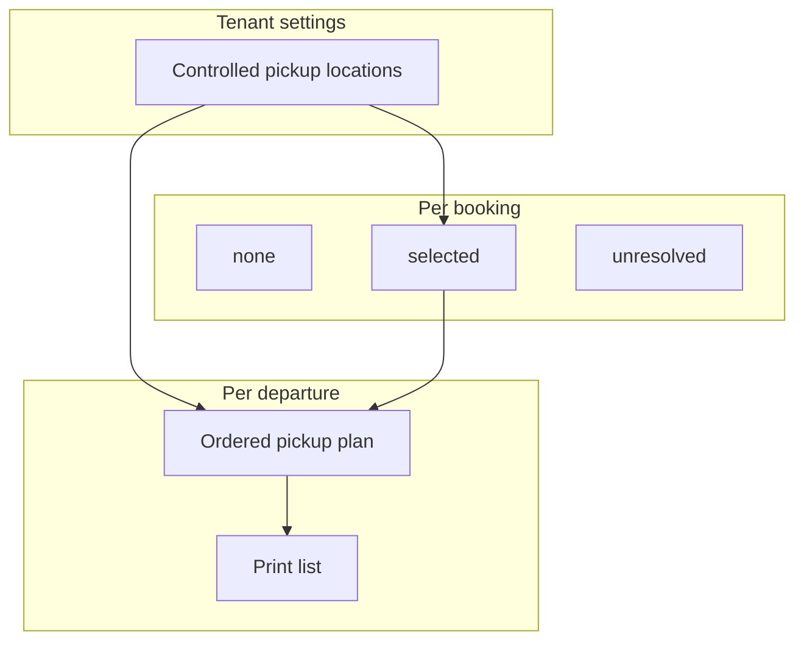

# Pickup disposition, plans, and print lists

**Status:** Track A model · updated 14 September 2026

## Two layers (do not merge)

| Layer | Owns | Who sets it | What it means |
| --- | --- | --- | --- |
| **Booking pickup disposition** | Commercial / guest fact on the booking | Reservations (create/amend); guest path later | `none` (meet at dock), `selected` (wants hotel/point pickup), or `unresolved` (still to arrange) |
| **Departure pickup plan** | Ops sequence for **one departure** | Dispatcher / admin / owner (`operations.write`) | Ordered stops, times, stop notes, dispatcher notes for that trip |
| **Print pickup list** | Paper/PDF handoff | Anyone with `manifest.read` | Read-only view of the **saved** plan + exceptions |

Controlled **pickup locations** are tenant master data (**Settings → Pickup locations**). They are reused across products. Plan pickups only **selects** from that library; it does not create locations.

## Settings → Pickup locations (library CRUD)

- Tab renders **outside** the tenant-config save `<form>` (same pattern as Integrations / Partners) so Add/Edit `FormDialog` is not nested.
- `FormDialog` / `ConfirmDialog` portal to `document.body`.
- Modal sections: **Identity** (name; code + kind in one row) → **Location** (address, lat/lng, map preview, map link) → **Operations** (notes, visibility).
- **Address default (create):** prefills from Tenant settings → General (`city`, parish/state, country display name).
- **Map preview:** Leaflet + **Esri World Street Map** tiles (no API key). Click to place/move pin. When no pin, map centers via Esri World Geocoding on the address / tenant place. Do **not** use `tile.openstreetmap.org` or CARTO public CDN (block / key required).
- Optional map URL + “Open in Maps” / fill-from-coordinates helpers remain. Coordinates are dispatch context only.

## Plan pickups (Phase 1 — complete)

- Header: product name, departure time badge, plan version, Print list (unsaved confirm).
- Metrics: stops planned, unresolved, not in plan, location count.
- Needs attention strip for unresolved / arranged-not-in-plan.
- Smart Add (match selected location, seed times), Add all, reorder, per-stop notes, dispatcher notes, save footer.
- Locations managed only via Settings link — no location CRUD on this page.
- Breadcrumb: `Workspace / Day Board / Plan pickups`.

## Print pickup list (Phase 1 polish — complete)

- Same header/metrics pattern as Plan pickups; Plan pickups + Print/PDF actions.
- Needs attention (screen); dispatcher note panel; numbered **sequence cards** for screen and print (no separate desktop table).
- Breadcrumb leaf: `Pickup list`.

## Day-of path

1. Day Board — readiness counts; **View / Board** + **Start trip** (no Pickup Plans card button).
2. Manifest **Options** — Plan pickups / Pickup list / weather-close.
3. Plan pickups — sequence guests with `selected` pickup; chase `unresolved` on the reservation.
4. Print list — driver handoff for that departure.

## Demo seed

On the rolling demo day (seed `day` = tomorrow Antigua), product 0 (Clear Boat / Sample Coastal) gets four planned stops (Port → hotel → Jolly → Club) plus one unresolved and one not-in-plan guest. See [Rock demo data](../../CLIENTS/rock-adventures/demo-data.md).

## Shared hotels vs shared van runs

- **Same location, many products:** supported.
- **One plan per departure:** each product departure has its own sequence.
- **One van serving multiple products on one run:** **not** Track A ([ADR 012](../../DECISIONS/012-operations-pickup-planning.md)).

## Authorization

| Action | Permission |
| --- | --- |
| Read board / plan / print list | `manifest.read` |
| Save departure pickup plan | `operations.write` |
| Create/edit/deactivate locations | `operations.write` (Settings UI) |
| Set booking disposition | booking create/amend permissions |

## Explicit non-goals

- Google Places autocomplete, Directions, Distance Matrix, live GPS, ETA SMS
- Auto-ordering stops by travel time
- Shared multi-product pickup runs
