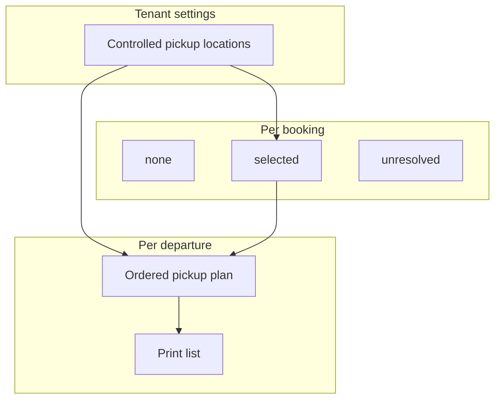

# Pickup disposition, plans, and print lists

**Status:** Track A model · documented 14 September 2026

## Two layers (do not merge)

| Layer | Owns | Who sets it | What it means |
| --- | --- | --- | --- |
| **Booking pickup disposition** | Commercial / guest fact on the booking | Reservations (create/amend); guest path later | `none` (meet at dock), `selected` (wants hotel/point pickup), or `unresolved` (still to arrange) |
| **Departure pickup plan** | Ops sequence for **one departure** | Dispatcher / admin / owner (`operations.write`) | Ordered stops, times, stop notes, dispatcher notes for that trip |
| **Print pickup list** | Paper/PDF handoff | Anyone with `manifest.read` | Read-only view of the **saved** plan + exceptions |

Controlled **pickup locations** are tenant master data (Settings → Pickup locations). They are reused across products. Plan pickups only **selects** from that library; it does not create locations. Staff may store an optional address, lat/lng pair, and map URL for dispatch context. The Add/Edit modal shows a free **Leaflet** pin preview on **Esri World Street Map** tiles (no API key; click to place when editing). Direct OSM.org / CARTO public CDNs are avoided (block or key required). Those fields do **not** activate Google Places geocoding, live GPS, or route optimization (deferred; see [ADR 012](../../DECISIONS/012-operations-pickup-planning.md)).

## Day-of path

1. Day Board — readiness counts; **View / Board** + **Start trip** (no separate Pickup Plans button).
2. Manifest **Options** — Plan pickups / Pickup list / weather-close.
3. Plan pickups — sequence guests who already have `selected` pickup; chase `unresolved` on the reservation.
4. Print list — driver handoff for that departure.

## Shared hotels vs shared van runs

- **Same location, many products:** supported. Jolly Beach is one library row used by many bookings and plans.
- **One plan per departure:** Kayak 9:00 and Clear Boat 11:00 each get their own sequence, even if they share hotels.
- **One van serving multiple products on one run:** **not** Track A. That needs a future day-route / shared-run entity. Deferred explicitly ([ADR 012](../../DECISIONS/012-operations-pickup-planning.md)).

## Authorization

| Action | Permission |
| --- | --- |
| Read board / plan / print list | `manifest.read` |
| Save departure pickup plan | `operations.write` |
| Create/edit/deactivate locations | `operations.write` (Settings UI) |
| Set booking disposition | booking create/amend permissions |

## Explicit non-goals here

- Route optimization, GPS, live driver re-plan
- Shared multi-product pickup runs
- SMS ETAs / customer pickup messaging from this surface
